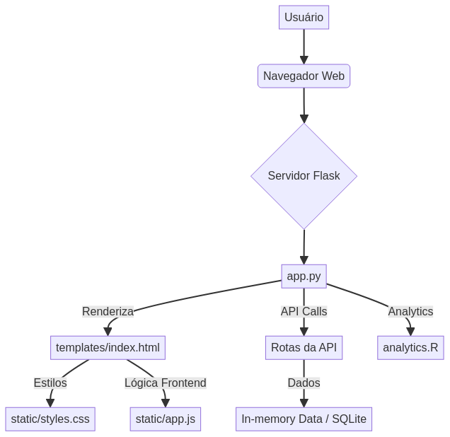
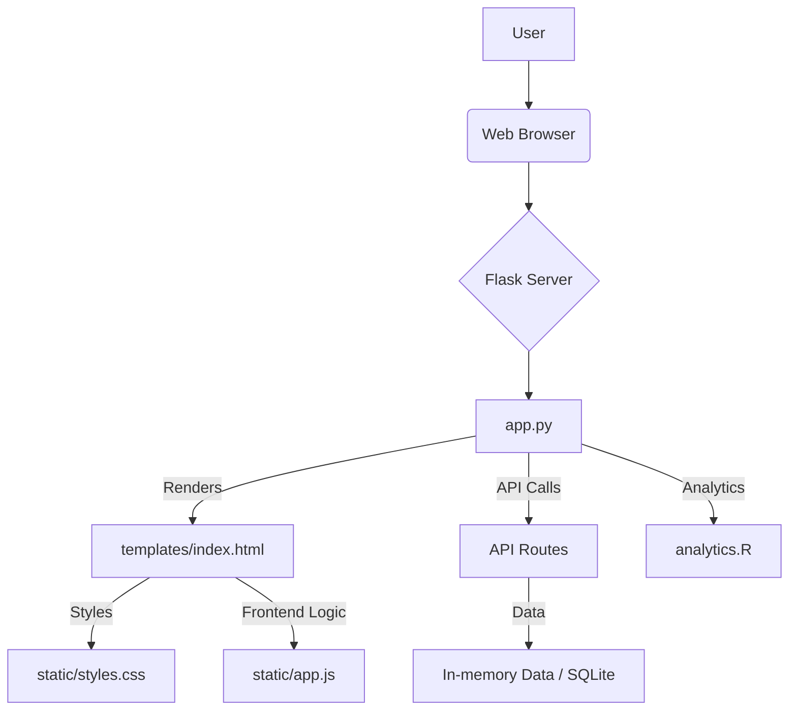

# Real Estate Marketplace


## Português

### Visão Geral

Este repositório apresenta um **Real Estate Marketplace** desenvolvido por Gabriel Demetrios Lafis. É uma aplicação web que simula um mercado imobiliário, permitindo a listagem, busca e gerenciamento de propriedades. O projeto foi construído com foco em **funcionalidade, didática e profissionalismo**, seguindo os mais altos padrões de qualidade para repositórios GitHub. Ele incorpora uma funcionalidade abrangente e uma stack de tecnologia moderna, com interfaces web interativas e capacidades de análise avançadas para soluções de nível profissional.

### Funcionalidades

#### Funcionalidade Principal

*   **Listagem e Visualização de Propriedades**: Permite a exibição detalhada de imóveis disponíveis.
*   **Busca e Filtragem Avançada**: Ferramentas para encontrar propriedades com base em diversos critérios.
*   **Gerenciamento de Favoritos**: Usuários podem salvar propriedades de interesse.
*   **Formulário de Contato para Agentes**: Facilita a comunicação entre interessados e agentes imobiliários.
*   **Visualização de Estatísticas do Mercado**: Dashboards e gráficos para análise de tendências.
*   **Processamento Avançado**: Algoritmos de alta performance e processamento de dados.
*   **Análises em Tempo Real**: Análise e visualização de dados ao vivo.
*   **Interface Interativa**: Interface web moderna com design responsivo.
*   **Análise Estatística**: Análises abrangentes baseadas em R e relatórios.
*   **Arquitetura Escalável**: Construído para performance de nível empresarial.

#### Interface Web

*   **UI Moderna**: Marcação semântica HTML5 com recursos de acessibilidade.
*   **Design Responsivo**: CSS3 com Grid, Flexbox e otimização para dispositivos móveis.
*   **Elementos Interativos**: JavaScript ES6+ com APIs web modernas.
*   **Atualizações em Tempo Real**: Conteúdo dinâmico e visualização de dados ao vivo.
*   **Estilização Profissional**: Animações e transições CSS personalizadas.

#### Análises e Relatórios

*   **Integração R**: Análise estatística avançada e visualização de dados.
*   **Processamento de Dados**: Limpeza e transformação automatizada de dados.
*   **Visualização**: Gráficos interativos e dashboards abrangentes.
*   **Métricas de Desempenho**: Monitoramento e análise em tempo real.
*   **Opções de Exportação**: Suporte a múltiplos formatos para relatórios e dados.

### Tecnologias Utilizadas

*   **Backend**: Python, Flask, SQLite
*   **Frontend**: HTML5, CSS3, JavaScript (ES6+)
*   **Análises**: R, ggplot2, dplyr, modelagem estatística
*   **Estilização**: CSS Grid, Flexbox, animações, design responsivo
*   **Recursos Modernos**: Async/await, Web APIs, classes ES6
*   **Processamento de Dados**: pandas, numpy, scikit-learn
*   **Visualização**: Gráficos interativos, dashboards em tempo real

### Estrutura do Projeto

```
real_estate_marketplace/
├── config/             # Arquivos de configuração (e.g., config.py)
├── data/               # Dados de exemplo ou estáticos
├── docs/               # Documentação adicional, diagramas
├── src/                # Código fonte da aplicação
│   ├── templates/      # Modelos HTML (Jinja2) (e.g., index.html)
│   ├── static/         # Arquivos estáticos (CSS, JS, imagens) (e.g., styles.css, app.js)
│   ├── app.py          # Aplicação Flask principal
│   ├── analytics.R     # Script R para análises
│   └── requirements.txt # Dependências Python
├── tests/              # Testes unitários e de integração (e.g., test_app.py)
├── .github/            # Configurações do GitHub (e.g., workflows, ISSUE_TEMPLATE, PULL_REQUEST_TEMPLATE)
├── .gitignore          # Arquivos e pastas a serem ignorados pelo Git
├── LICENSE             # Informações sobre a licença do projeto
└── README.md           # Este arquivo
```

### Como Executar

1.  **Clone o repositório:**

    ```bash
    git clone https://github.com/galafis/real_estate_marketplace.git
    cd real_estate_marketplace
    ```

2.  **Crie e ative um ambiente virtual (recomendado):**

    ```bash
    python3 -m venv venv
    source venv/bin/activate
    ```

3.  **Instale as dependências Python:**

    ```bash
    pip install -r src/requirements.txt
    ```

4.  **Instale as dependências R (se aplicável):**

    ```bash
    Rscript -e "install.packages(c(\'ggplot2\', \'dplyr\', \'corrplot\', \'plotly\'))"
    ```

5.  **Execute a aplicação Flask:**

    ```bash
    python3 src/app.py
    ```

    A aplicação estará disponível em `http://127.0.0.1:5000`.

### Diagramas de Arquitetura



### Imagem Hero


### Contribuição

Contribuições são bem-vindas! Para sugestões ou melhorias, por favor, abra uma issue ou envie um pull request. Siga o `CONTRIBUTING.md` para mais detalhes.

### Licença

Este projeto está licenciado sob a Licença MIT. Veja o arquivo `LICENSE` para mais detalhes.

### Autor

**Gabriel Demetrios Lafis**
- Email: gabrieldemetrios@gmail.com
- LinkedIn: [Gabriel Demetrios Lafis](https://www.linkedin.com/in/gabriel-demetrios-lafis-62197711b)
- GitHub: [galafis](https://github.com/galafis)

---

## English

### Overview

This repository presents a **Real Estate Marketplace** developed by Gabriel Demetrios Lafis. It is a web application that simulates a real estate market, allowing for property listing, searching, and management. The project was built with a focus on **functionality, didacticism, and professionalism**, adhering to the highest quality standards for GitHub repositories. It incorporates comprehensive functionality and a modern technology stack, with interactive web interfaces and advanced analytics capabilities for professional-grade solutions.

### Features

#### Core Functionality

*   **Property Listing and Viewing**: Allows detailed display of available properties.
*   **Advanced Search and Filtering**: Tools to find properties based on various criteria.
*   **Favorites Management**: Users can save properties of interest.
*   **Agent Contact Form**: Facilitates communication between interested parties and real estate agents.
*   **Market Statistics Visualization**: Dashboards and charts for trend analysis.
*   **Advanced Processing**: High-performance algorithms and data processing.
*   **Real-time Analytics**: Live data analysis and visualization.
*   **Interactive Interface**: Modern web interface with responsive design.
*   **Statistical Analysis**: Comprehensive R-based analytics and reporting.
*   **Scalable Architecture**: Built for enterprise-level performance.

#### Web Interface

*   **Modern UI**: HTML5 semantic markup with accessibility features.
*   **Responsive Design**: CSS3 with Grid, Flexbox, and mobile optimization.
*   **Interactive Elements**: JavaScript ES6+ with modern web APIs.
*   **Real-time Updates**: Dynamic content and live data visualization.
*   **Professional Styling**: Custom CSS animations and transitions.

#### Analytics & Reporting

*   **R Integration**: Advanced statistical analysis and data visualization.
*   **Data Processing**: Automated data cleaning and transformation.
*   **Visualization**: Interactive charts and comprehensive dashboards.
*   **Performance Metrics**: Real-time monitoring and analytics.
*   **Export Options**: Multiple format support for reports and data.

### Technologies Used

*   **Backend**: Python, Flask, SQLite
*   **Frontend**: HTML5, CSS3, JavaScript (ES6+)
*   **Analytics**: R, ggplot2, dplyr, statistical modeling
*   **Styling**: CSS Grid, Flexbox, animations, responsive design
*   **Modern Features**: Async/await, Web APIs, ES6 classes
*   **Data Processing**: pandas, numpy, scikit-learn
*   **Visualization**: Interactive charts, real-time dashboards

### Project Structure

```
real_estate_marketplace/
├── config/             # Configuration files (e.g., config.py)
├── data/               # Sample or static data
├── docs/               # Additional documentation, diagrams
├── src/                # Application source code
│   ├── templates/      # HTML templates (Jinja2) (e.g., index.html)
│   ├── static/         # Static files (CSS, JS, images) (e.g., styles.css, app.js)
│   ├── app.py          # Main Flask application
│   ├── analytics.R     # R script for analytics
│   └── requirements.txt # Python dependencies
├── tests/              # Unit and integration tests (e.g., test_app.py)
├── .github/            # GitHub configurations (e.g., workflows, ISSUE_TEMPLATE, PULL_REQUEST_TEMPLATE)
├── .gitignore          # Files and folders to be ignored by Git
├── LICENSE             # Project license information
└── README.md           # This file
```

### How to Run

1.  **Clone the repository:**

    ```bash
    git clone https://github.com/galafis/real_estate_marketplace.git
    cd real_estate_marketplace
    ```

2.  **Create and activate a virtual environment (recommended):**

    ```bash
    python3 -m venv venv
    source venv/bin/activate
    ```

3.  **Install Python dependencies:**

    ```bash
    pip install -r src/requirements.txt
    ```

4.  **Install R dependencies (if applicable):**

    ```bash
    Rscript -e "install.packages(c(\'ggplot2\', \'dplyr\', \'corrplot\', \'plotly\'))"
    ```

5.  **Run the Flask application:**

    ```bash
    python3 src/app.py
    ```

    The application will be available at `http://127.0.0.1:5000`.

### Architecture Diagrams



### Contribution

Contributions are welcome! For suggestions or improvements, please open an issue or submit a pull request. Follow the `CONTRIBUTING.md` for more details.

### License

This project is licensed under the MIT License. See the `LICENSE` file for more details.

### Author

**Gabriel Demetrios Lafis**
- Email: gabrieldemetrios@gmail.com
- LinkedIn: [Gabriel Demetrios Lafis](https://www.linkedin.com/in/gabriel-demetrios-lafis-62197711b)
- GitHub: [galafis](https://github.com/galafis)

